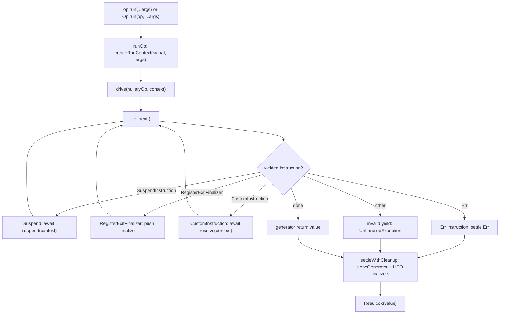

# Contributing

## Setup

- Use Node `>=24.14.0` on the 24.x Active LTS line (current LTS; codename Krypton) and `pnpm@10` (validated in CI on `10.11.0`). `.nvmrc` pins `24.14.0`.
- Run commands from the repo root unless noted otherwise.

```bash
pnpm install
```

## Monorepo Orientation

- This repository is a pnpm workspace monorepo orchestrated by Turborepo (`turbo`).
- Root scripts (`pnpm run build|test|lint|typecheck|gate`) run across the workspace graph.
- Publishable libraries today: **`@prodkit/op`** and **`@prodkit/std`** (see `packages/op`, `packages/std`).
- Supporting workspaces: **`@prodkit/shared`** (`packages/shared`, private workspace types/config), **`@prodkit/examples`** (`examples/`), **`@prodkit/tools`** (`tools/`), **`@prodkit/benchmarks`** (`benchmarks/`).
- `@prodkit/op` landed first historically; the repo is intentionally multi-package.
- Package-scoped scripts stay in the owning workspace `package.json`; invoke them with `pnpm --filter <workspace> run <script>`.

## Contributor Runtime

- Node `>=24.14.0` on 24.x Active LTS is required for local development and release tasks. Node 22.x is maintenance LTS; this repo standardizes on 24.x, not 22 or 20.
- This requirement is for contributors/tooling only; the library API is runtime-agnostic for consumers.

## Local Quality Gate

Run the same checks used before publishing:

```bash
pnpm run gate
```

The quality gate includes a consumer-level smoke test that installs `@prodkit/op` and `@prodkit/std`
from `npm pack` tarballs via `examples/` in an isolated temp workspace.

Pull requests and pushes to `main` run the same gate in `.github/workflows/ci.yml`.
CI also publishes a Vitest coverage report as a workflow artifact (`op-coverage`) so reviewers can
audit unit, integration, type, and property-law coverage evidence from the run. `@prodkit/std`
coverage is omitted until utility modules ship in `packages/std/src/`.
A `changelog:api:check` gate step fails when `packages/op/src/index.ts`,
`packages/op/src/di/index.ts`, `packages/op/src/policy/index.ts`, or `packages/op/src/hkt.ts`
public export names change without an update to that package's `CHANGELOG.md` under
`## [Unreleased]`. Internal re-export paths do not count as API changes.
A `bundle-size` job compares `@prodkit/op` minified + gzip bundle size on pull requests via
`compressed-size-action`; runtime regressions are tracked separately by CodSpeed
(see [`packages/op/PERFORMANCE.md`](packages/op/PERFORMANCE.md) and [`benchmarks/op/README.md`](benchmarks/op/README.md)).

All runnable consumer examples and smoke entrypoints live in the **`examples/`** workspace (`@prodkit/examples`):

```text
examples/
  op/                 core Op samples (combinators, defer, webhook, ...)
  op/di/              @prodkit/op/di samples (onboarding, cancellation, HTTP handler)
  std/                reserved for future @prodkit/std utility samples
  smoke.ts            runs op, di, and std smoke suites
```

## Benchmarking

Use CodSpeed (CI), the comparison harness, and the local profile harness when you need to validate runtime overhead or investigate regressions:

```bash
pnpm run bench
pnpm --filter @prodkit/benchmarks run compare
pnpm --filter @prodkit/tools run performance:sync -- --write
pnpm --filter @prodkit/benchmarks run profile
```

- CodSpeed comments on pull requests with runtime regression data; see [`benchmarks/op/README.md`](benchmarks/op/README.md).
- Bundle-size deltas appear on pull requests via the CI `bundle-size` job.
- `compare` + `performance:sync` refresh the public native-vs-Op table in [`packages/op/PERFORMANCE.md`](packages/op/PERFORMANCE.md).
- Use `profile.ts` locally after a CodSpeed regression to isolate overhead sources.

Detailed benchmark scenarios and authoring guidance live in `benchmarks/op/README.md`.
Published baseline interpretation lives in [`packages/op/PERFORMANCE.md`](packages/op/PERFORMANCE.md).

## Type Cast Policy

- Every remaining cast must carry an inline comment describing the concrete TypeScript limitation.
- Treat casts as a last resort after trying type-level restructuring first.
- New casts should be called out in PR descriptions so reviewers can audit the tradeoff.

## Testing Strategy

`@prodkit/op` keeps tests out of `src/` under `packages/op/tests/` with one file per tier:

- **Unit** (`tests/unit/`) verifies module-local invariants by importing the module under test from `../../src/...`.
- **Integration** (`tests/integration/`) verifies public API shape, re-exports, and cross-module composition contracts. Prefer importing from `../../src/index.js`; shared timing helpers live in `tests/support/`.
- **Property** (`tests/property/`) holds fast-check invariant suites (combinators, monad laws, backoff, retry).
- **Types** (`tests/types/`) holds compile-time type contracts (`expectTypeOf`, assertion types).
- **Hygiene** (`tests/hygiene/`) holds repo/API documentation checks.
- **Support** (`tests/support/`) holds shared helpers (`utils.ts`, `type-utils.ts`).

If a behavior is an internal invariant of one module, keep it in unit; if it is a public composition/API contract, keep it in integration. Avoid duplicate assertions across tiers unless each tier validates meaningfully different risk.

**`@prodkit/op/di`** runtime tests live under `packages/op/tests/unit/di/` (for example
`index.test.ts`); compile-time DI contracts live in `packages/op/tests/types/di.test.ts`. Run
`pnpm --filter @prodkit/op run coverage` locally to reproduce CI coverage for DI and the core runtime.

## Source Layout (`@prodkit/op`)

- Public package entrypoint stays at `packages/op/src/index.ts`.
- Re-exports from dependencies must be explicit named exports in `packages/op/src/index.ts` (never `export *`).
- Internal runtime concerns are split into focused modules under `packages/op/src/`:
  - `core/` (core operation contracts and execution runtime pieces)
  - `builders.ts` (primitive operation constructors)
  - `policy/` (retry, timeout, cancel, release policies and `Delay` helpers)
  - `hkt.ts` (reusable HKT primitives for `@prodkit/op/hkt`)
  - `combinators.ts` (all/any/race combinators)
  - `errors.ts`, `result.ts`, `tagged.ts` (shared domain contracts)
  - `shared.ts` (small shared type/runtime helpers)
- `@prodkit/shared` (`packages/shared`, private): workspace-only shared typings and config. Today this includes `platform-globals.d.ts` (runtime-global typings for packages without DOM `lib`). Consumers declare `"@prodkit/shared": "workspace:*"` and set `"types": ["@prodkit/shared"]` in tsconfig.
- Test layout under `packages/op/tests/`:
  - `integration/index.test.ts` for public API contract coverage
  - `unit/errors.test.ts` for typed error contracts
  - `unit/builders.test.ts` for operation builders, runtime composition, and builder type-inference contracts
  - `unit/policies.test.ts` for retry/timeout/signal behavior
  - `unit/core.test.ts` for core execution invariants
  - `unit/lifecycle.test.ts` for lifecycle/finalizer behavior
  - `unit/fluent.test.ts` for fluent operator semantics
  - `unit/di/index.test.ts` for DI runtime behavior
  - `property/monad-laws.test.ts` for algebraic contract checks
  - `types/op.test.ts` for compile-time type contracts
  - `types/di.test.ts` for DI compile-time type contracts
- Runtime invariants and execution semantics are documented in `packages/op/DESIGN.md`.
- Structural rationale for core/fluent choices (why separate paths exist) lives in `docs/adr/`.
  Each ADR declares `title`, `status`, and `packages` in YAML frontmatter; run
  `pnpm --filter @prodkit/tools run adr:sync` after adding or editing one.
- Implementation work for accepted or proposed ADRs is tracked in GitHub issues, not in ad hoc
  docs under `docs/`. Link issues from the ADR `Implementation` section when filing them.

## Core runtime architecture (`@prodkit/op`)

This section is an execution-level map of how a single `Op` run moves through the codebase.
Correctness invariants (cleanup ordering, combinator semantics, settlement rules) live in
[`packages/op/DESIGN.md`](packages/op/DESIGN.md). ADRs under [`docs/adr/`](docs/adr/) explain
why the core/fluent split and policy hooks are shaped the way they are.

### Module dependency graph

At a high level, public entrypoints fan into builders and combinators, both of which compose
nullary core ops and always settle through the same driver:

```text
packages/op/src/index.ts          (Op factory, Op.run, re-exports)
  |-- builders.ts                 (Op.of, Op.try, fromGenFn, Op.defer, ...)
  |-- combinators.ts              (Op.all, Op.any, Op.race, ...)
  |-- policy/                     (Policy.* constructors, retry-policy, plan rewriters)
  |-- hkt.ts                      (@prodkit/op/hkt entry)
  |-- core/run-op.ts              (runOp -> drive)
  |-- core/fluent.ts              (makeCoreOp, makePlanOp shell, fluent transforms)
  |-- core/plan/                  (Plan AST, lifecycle, shell)
  |-- core/runtime.ts             (createRunContext, drive)  <-- single execution engine
  |-- core/instructions.ts        (Suspend, RegisterExitFinalizer, Err yields)

packages/op/src/di/                 (DI.provide, DI.inject via CustomInstruction + extensions)
  '-- imports core/runtime, core/instructions, core/types, builders directly

packages/std/src/                   (future runtime-agnostic utility subpaths)
```

### From `Op.run()` to `drive()`

1. **Call site.** `await op.run(...args)` or `await Op.run(op, ...args)` both end in
   `runOp` (`packages/op/src/core/run-op.ts`), which calls
   `drive(op, createRunContext(signal, args))`. Tuple args flow into `RunContext.args` for
   enter/exit hooks; they are not an options bag ([ADR 0006](docs/adr/0006-run-args-only-fluent-policy-composition.md)).
2. **Arity binding.** For generator-defined ops, `fromGenFn` in `builders.ts` wraps the user
   generator in `makeCoreOp` once per `op(...args)` call, binds defer args via
   `bindArityArgsToFinalizers`, and exposes the callable through `makeArityOp` / `makeFluentOp`
   ([ADR 0001](docs/adr/0001-core-nullary-vs-lifted-arity.md)).
3. **Nullary execution.** `drive` only accepts `Op<T, E, [], M>`: a nullary op whose body is a
   generator function `() => Generator<Instruction, T>`. Everything that participates in `yield*`
   composition (policies, combinators, `flatMap`, DI `provide`) runs at this arity internally;
   lifting re-attaches tuple call signatures at the public boundary.
4. **Settlement.** `drive` walks instructions until the generator completes or yields a terminal
   `Result.err`, then runs registered exit finalizers LIFO and may override the body result with
   `Err(UnhandledException)` when teardown fails ([ADR 0003](docs/adr/0003-three-cleanup-channels.md),
   [ADR 0005](docs/adr/0005-unhandled-exception-runtime-channel.md)).

Built-in policies (retry, timeout, cancel) attach on the op value **before** `.run()`, not as extra
`run` parameters ([ADR 0006](docs/adr/0006-run-args-only-fluent-policy-composition.md)).

### Instruction lifecycle

Each `yield` from an op generator produces an `Instruction` discriminant. `drive` in
`packages/op/src/core/runtime.ts` dispatches on the yielded value:

| Yielded value | Driver action |
| --- | --- |
| `SuspendInstruction` | Await `suspend(runContext)` (abort-aware when `driveInterruptOnAbort` is used), resume generator with the settled value |
| `RegisterExitFinalizerInstruction` | Push `finalize` onto a per-run LIFO stack (optional frozen `args` for arity-bound defers) |
| `CustomInstruction` | Await `resolve(runContext)` and resume (extension hook; see DI below) |
| `Result.err(...)` (`Err` instruction) | Short-circuit to `Err` and run exit finalizers |
| Anything else | `Err(UnhandledException)` for invalid yields |

Suspends are how policies and combinators nest work: they call `drive` (or `driveInterruptOnAbort`)
on child ops with child or merged `RunContext` values rather than blocking the outer generator
thread.

### Policy wrappers (retry, timeout, cancel)

Built-in policies attach through `.with(Policy.*)` on the op value (`packages/op/src/core/plan/shell.ts`,
`packages/op/src/policy/index.ts`) and compose as plan wrappers:

- **Retry** (`retryPlan`): loops inner execution inside a `SuspendInstruction`, applies
  `RetryPolicy` delay via abortable sleep (`retries` is the post-failure budget; `delay(retry, cause)`
  uses a 0-based retry index), and stops on success, non-retryable `Err`, or abort.
- **Timeout** (`timeoutPlan`): races inner `executePlanInterruptOnAbort` against a timer;
  surfaces `TimeoutError` on the typed channel. Invalid `timeoutMs` (negative or non-finite) fails
  at run time as `Err(UnhandledException)`. Error-channel transforms compose through plan rewriters
  ([ADR 0007](docs/adr/0007-timeout-widening-at-composition-boundary.md); historical hook detail in
  superseded [ADR 0002](docs/adr/0002-ophooks-rebuild-and-timeout-asymmetry.md)).
- **Cancel** (`cancelPlan`): merges a caller-supplied `AbortSignal` with the run context signal
  through a composed `AbortController` so either parent or bound signal can cancel the inner run.

Method order on the fluent object defines wrapper nesting (outermost policy is applied last in
the chain). See policy ordering notes in `packages/op/DESIGN.md`.

### DI integration via `RunContext.extensions`

`@prodkit/op/di` extends the runtime without forking the driver:

1. **`DI.inject(dependency)`** yields an `InjectInstruction`, a `CustomInstruction` whose
   `resolve(context)` reads bindings from `context.extensions`.
2. **`DI.provide(op, entries)`** (`provideOp` in `packages/op/src/di/internal.ts`) wraps the
   user op in a suspend that calls `drive(inner, extendContext(context, entries))`, cloning
   `extensions` and storing the binding `Map` under an internal extension key.
3. **Metadata.** Provided dependencies block bare `.run()` until satisfied via `ProvidedMeta`
   / `withBlocking` on the op type surface.

Scoped bindings (`DI.scoped`) receive the run `AbortSignal` in their factory (same contract as
`Op.try`). Resolution skips an already-aborted factory call, awaits async factories with
DI-native abort handling, and memoizes only after successful settlement.

Custom instructions are the supported extension point for other packages that need run-scoped
state visible inside `SuspendInstruction` and `CustomInstruction.resolve` callbacks.

### Runnable metadata (`Blocking`, `withBlocking`)

Top-level `.run()` / `Op.run(...)` are typed only when operation metadata has no unsatisfied
`Blocking<T>` entries (`IsRunnable<M>` in `packages/op/src/core/types.ts`).

- **`Blocking<T>`** is branded metadata; merge at a key unions payloads with other `Blocking`
  values at that key.
- **`withBlocking(op, key)`** is a type-only helper on `@prodkit/op/internal`; runtime behavior of
  the op is unchanged. Clears when your extension replaces or removes the blocking entry on `key`.
- **DI**: `DI.inject` accumulates `{ deps: Blocking<Dependency> }`; `DI.provide` clears satisfied
  keys. Consumer-facing behavior is documented under `@prodkit/op/di` in `packages/op/README.md`.

Import extension helpers from `@prodkit/op/internal` (for example `Blocking`, `withBlocking`,
`EmptyMeta`, `MergeMeta`, `InferOpMeta`, `CustomInstruction`, `BlockingOp`, `AbortSignalLike`,
`unsafeCoerce`, `NEVER`). The main `@prodkit/op` entry keeps consumer-facing lifecycle types
(`EnterContext`, `ExitContext`) and errors only.

### Combinators and nested `drive`

`packages/op/src/combinators.ts` runs multiple child `drive` calls (often with per-child
`AbortController` signals) and enforces ordering contracts documented in `DESIGN.md`.
`Op.any` and `Op.race` wait for loser finalization before the parent `run()` settles
([ADR 0004](docs/adr/0004-combinators-wait-for-loser-finalization.md)).

### Driver loop (call flow)



For a traced example, start from [`examples/op/`](examples/op/) (especially defer, signal, and
combinator samples) and follow imports into `core/runtime.ts`.

## Source layout (`@prodkit/shared`)

- Private workspace package under `packages/shared/`; not published to npm.
- Export map today: `@prodkit/shared` / `@prodkit/shared/platform-globals` (ambient runtime-global typings).
- Publishable packages that need those globals declare `"@prodkit/shared": "workspace:*"` and set `"types": ["@prodkit/shared"]` in tsconfig `compilerOptions`.

## Source layout (`@prodkit/std`)

- Source under `packages/std/src/`; published entrypoint is `@prodkit/std` (utility subpaths such as
  `@prodkit/std/array` are planned).
- Package docs: [`packages/std/README.md`](packages/std/README.md). Ship changelog: [`packages/std/CHANGELOG.md`](packages/std/CHANGELOG.md).

You can run consumer install path checks directly. Each mode builds a temporary mini-pnpm workspace (reusing the repo `catalog:` from `pnpm-workspace.yaml`), installs `@prodkit/op` and `@prodkit/std` from the chosen source, then runs `examples/` smoke:

```bash
pnpm --filter @prodkit/tools run examples:smoke:pack
pnpm --filter @prodkit/tools run examples:smoke:github
pnpm --filter @prodkit/tools run examples:smoke:npm
pnpm --filter @prodkit/op run test
pnpm --filter @prodkit/std run test
```

## Release Workflow (Recommended)

Publishable packages use package-scoped git tags (`op-vX.Y.Z`, `std-vX.Y.Z`).
Pushing a tag triggers [`.github/workflows/release.yml`](.github/workflows/release.yml),
which publishes the matching npm package. Legacy plain `v*` tags remain in history but
are not used for new releases.

1. Keep the package changelog updated under `## [Unreleased]` as work lands:

   - `@prodkit/op`: `packages/op/CHANGELOG.md`
   - `@prodkit/std`: `packages/std/CHANGELOG.md`

2. Cut a release (this promotes `Unreleased`, bumps npm version in the package
   `package.json`, runs release checks, commits, and creates a package-scoped tag):

```bash
pnpm --filter @prodkit/op run release:patch
pnpm --filter @prodkit/std run release:patch
```

*Note:* `release:minor` and `release:major` will be added when needed.

If `Unreleased` is empty, the cut script writes a minimal
"No user-facing changes" note for the new version.
The changelog/version updates must be committed before tag creation because
release validation runs against the tagged commit.

3. Push commit and tag:

```bash
pnpm --filter @prodkit/op run release:push
pnpm --filter @prodkit/std run release:push
```

4. The workflow (for tags like `op-v0.1.70` or `std-v0.1.1`) then:

   - validates the tag is the latest package-scoped tag on `main`
   - installs with `pnpm install --frozen-lockfile`
   - publishes with npm trusted publishing (OIDC) and provenance
     (`pnpm --filter @prodkit/<package> publish --provenance --access public --no-git-checks`)

## Release Failure Recovery

If a release tag is pushed but the release workflow fails (for example,
changelog/version mismatch), use a forward-fix workflow:

1. Leave the failed tag as-is (do not rewrite tag history by default).
2. Add the missing changelog note under the package changelog under `## [Unreleased]`.
3. Cut the next patch release:

```bash
pnpm --filter @prodkit/op run release:patch
```

4. Push commit and tag:

```bash
pnpm --filter @prodkit/op run release:push
```

The failed run remains red in history, but the next tag should publish cleanly.

Only use tag deletion/force-retagging when absolutely necessary and explicitly
approved.

## Manual Publish Fallback

`@prodkit/op`:

```bash
pnpm --filter @prodkit/op run release:prepare
pnpm --filter @prodkit/op publish --access public --provenance --no-git-checks
```

`@prodkit/std` (after version + changelog updates):

```bash
pnpm --filter @prodkit/std run release:prepare
pnpm --filter @prodkit/std publish --access public --provenance --no-git-checks
```
