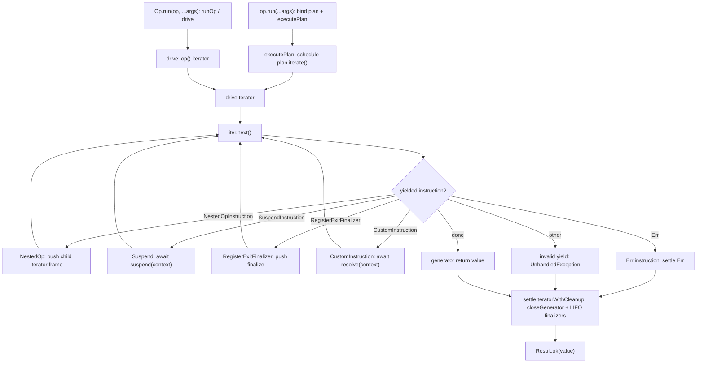

# Op runtime architecture (`@prodkit/op`)

Execution-level map of how a single `Op` run moves through the codebase. Correctness invariants
(cleanup ordering, combinator semantics, settlement rules) live in
[`op-invariants.md`](op-invariants.md). ADRs under [`docs/adr/`](../adr/) explain
why the nullary driver, plan AST, and policy hooks are shaped the way they are. Domain vocabulary
and documentation roles: [`docs/CONTEXT.md`](../CONTEXT.md).

## Module dependency graph

The internal layout names three distinct responsibilities:

- `core/`: callable `Op` surface, construction, lifecycle types, identity, and metadata
- `plan/`: execution AST model, iterative composition and rewrite, Op bridge, and plan nodes
- `execution/`: Plan scheduling, generator driver, instructions, cleanup, settlement, child signal wiring, and fan-out

Public entrypoints fan into core builders and combinators. Those construct plan nodes, and all plan
execution settles through the same execution driver:

```text
packages/op/src/index.ts          (Op factory, Op.run, re-exports)
  |-- core/
  |   |-- builders.ts             (Op.of, Op.try, fromGenFn, Op.defer, ...)
  |   |-- combinators.ts          (Op.all, Op.any, Op.race, Op.allSettled, Op.settle, ...)
  |   |-- shell.ts                (callable Op object and fluent methods)
  |   |-- surface.ts              (Op interfaces and inference helpers)
  |   |-- generator.ts            (makeCoreOp: nullary generator leaf adapter)
  |   |-- identity.ts             (brands, isOp, nullary coercion)
  |   |-- lifecycle.ts            (enter, exit, and release callback contracts)
  |   '-- metadata.ts             (EmptyMeta, Blocking, MergeMeta, IsRunnable)
  |-- plan/
  |   |-- model.ts                (Plan interface, iterative fluent materialization and rewrite)
  |   |-- bridge.ts               (Op-to-Plan binding and lookup)
  |   |-- transforms.ts           (map, flatMap, tap, mapErr, tapErr, recover)
  |   |-- lifecycle.ts            (enter and exit plan nodes)
  |   '-- combinators.ts          (all, any, race, allSettled, settle plan nodes)
  |-- execution/
  |   |-- runtime.ts              (Plan scheduling, generator driver, run context, cleanup settlement)
  |   |-- instructions.ts         (nested Op frames, Suspend, exit finalizer, CustomInstruction)
  |   |-- cleanup.ts              (generator close and registered finalizers)
  |   |-- abort-settlement.ts     (driver-level abort settlement mechanics)
  |   |-- settlement.ts           (named nested plan and suspend settlement operations)
  |   |-- child-run.ts            (scenario-based child AbortSignal wiring)
  |   '-- fan-out.ts              (bounded and unbounded combinator child scheduling)
  |-- policy/                     (Policy.* constructors, retry-policy, plan rewriters)
  |-- di/                         (DI.provide, DI.inject, run-context environment)
  |-- hkt.ts                      (@prodkit/op/hkt entry)
  '-- errors.ts, result.ts, tagged.ts (shared contracts)
```

Verified import contracts are checked by
`pnpm --filter @prodkit/tools run architecture:check`.

**Closed modules** document every `packages/op/src` import from that file. Use for extension seams and
small plan modules where surprise imports are regressions.

<!-- architecture-check-closed: packages/op/src/di/types.ts -->
<!-- architecture-check-closed: packages/op/src/di/env.ts -->
<!-- architecture-check-closed: packages/op/src/di/plan.ts -->
<!-- architecture-check-closed: packages/op/src/plan/bridge.ts -->
<!-- architecture-check-closed: packages/op/src/execution/settlement.ts -->
<!-- architecture-check-closed: packages/op/src/execution/child-run.ts -->

**Partial edges** document specific architectural links. Each line must match source; hub modules
(for example `shell.ts`) may import more than the list shows.

- `packages/op/src/core/shell.ts` imports `packages/op/src/plan/model.ts`
- `packages/op/src/core/shell.ts` imports `packages/op/src/execution/instructions.ts`
- `packages/op/src/core/shell.ts` imports `packages/op/src/execution/settlement.ts`
- `packages/op/src/di/types.ts` imports `packages/op/src/core/metadata.ts`
- `packages/op/src/di/types.ts` imports `packages/op/src/index.ts`
- `packages/op/src/di/types.ts` imports `packages/op/src/di/index.ts`
- `packages/op/src/di/env.ts` imports `packages/op/src/di/types.ts`
- `packages/op/src/di/env.ts` imports `packages/op/src/execution/runtime.ts`
- `packages/op/src/di/env.ts` imports `@prodkit/shared/runtime`
- `packages/op/src/di/plan.ts` imports `packages/op/src/di/types.ts`
- `packages/op/src/di/plan.ts` imports `packages/op/src/di/env.ts`
- `packages/op/src/di/plan.ts` imports `packages/op/src/plan/bridge.ts`
- `packages/op/src/di/plan.ts` imports `packages/op/src/plan/model.ts`
- `packages/op/src/di/plan.ts` imports `packages/op/src/core/surface.ts`
- `packages/op/src/di/plan.ts` imports `packages/op/src/core/shell.ts`
- `packages/op/src/di/plan.ts` imports `packages/op/src/execution/instructions.ts`
- `packages/op/src/di/plan.ts` imports `packages/op/src/execution/runtime.ts`
- `packages/op/src/di/plan.ts` imports `packages/op/src/core/metadata.ts`
- `packages/op/src/di/plan.ts` imports `packages/op/src/errors.ts`
- `packages/op/src/di/plan.ts` imports `packages/op/src/result.ts`
- `packages/op/src/di/plan.ts` imports `packages/op/src/index.ts`
- `packages/op/src/di/plan.ts` imports `@prodkit/shared/runtime`
- `packages/op/src/plan/bridge.ts` imports `packages/op/src/index.ts`
- `packages/op/src/plan/bridge.ts` imports `packages/op/src/core/identity.ts`
- `packages/op/src/plan/bridge.ts` imports `packages/op/src/core/surface.ts`
- `packages/op/src/plan/bridge.ts` imports `packages/op/src/plan/model.ts`
- `packages/op/src/plan/bridge.ts` imports `@prodkit/shared/runtime`
- `packages/op/src/execution/settlement.ts` imports `packages/op/src/execution/instructions.ts`
- `packages/op/src/execution/settlement.ts` imports `packages/op/src/plan/model.ts`
- `packages/op/src/execution/settlement.ts` imports `packages/op/src/execution/runtime.ts`
- `packages/op/src/execution/settlement.ts` imports `packages/op/src/execution/abort-settlement.ts`
- `packages/op/src/execution/settlement.ts` imports `packages/op/src/errors.ts`
- `packages/op/src/execution/settlement.ts` imports `packages/op/src/result.ts`
- `packages/op/src/execution/settlement.ts` imports `@prodkit/shared/runtime`
- `packages/op/src/execution/child-run.ts` imports `packages/op/src/execution/runtime.ts`
- `packages/op/src/execution/child-run.ts` imports `packages/op/src/execution/abort-settlement.ts`
- `packages/op/src/execution/child-run.ts` imports `packages/op/src/errors.ts`
- `packages/op/src/execution/child-run.ts` imports `packages/op/src/result.ts`
- `packages/op/src/execution/child-run.ts` imports `@prodkit/shared/runtime`
- `packages/op/src/plan/combinators.ts` imports `packages/op/src/execution/settlement.ts`
- `packages/op/src/execution/fan-out.ts` imports `packages/op/src/execution/child-run.ts`
- `packages/op/src/execution/fan-out.ts` imports `packages/op/src/execution/settlement.ts`
- `packages/op/src/di/env.ts` imports `packages/op/src/execution/settlement.ts`
- `packages/op/src/di/plan.ts` imports `packages/op/src/execution/settlement.ts`
- `packages/op/src/policy/plan.ts` imports `packages/op/src/execution/child-run.ts`
- `packages/op/src/policy/plan.ts` imports `packages/op/src/execution/settlement.ts`
- `packages/op/src/execution/runtime.ts` imports `packages/op/src/plan/model.ts`
- `packages/op/src/execution/runtime.ts` imports `@prodkit/shared/runtime`
- `packages/op/src/plan/model.ts` imports `packages/op/src/execution/runtime.ts`

## Composition depth

Contributors need one depth contract: user-shaped composition must not consume the host JavaScript
call stack. Ownership follows execution phase rather than exposing separate stack-safety systems:

- Before execution, `packages/op/src/plan/model.ts` iteratively materializes fluent transforms and
  walks unary policy-rewrite metadata. `core/shell.ts` only appends transforms through that module.
- During execution, `packages/op/src/execution/runtime.ts` owns both Plan reentrancy scheduling and
  the generator driver. Deep sequential Plan nodes yield through `executePlan`; direct
  `yield* childOp` uses explicit iterator frames in `driveIterator`.

Other Plan, policy, DI, and combinator modules declare composition and settlement intent. They
should not add local depth counters, recursive rewrite walks, or independent execution trampolines.
The invariant and representative tests are in
[`op-invariants.md`](op-invariants.md#invariant-4-user-shaped-composition-depth-does-not-consume-the-host-stack).

## From `Op.run()` to `drive()`

1. **Call site.** `await op.run(...args)` binds a Plan and calls `executePlan`.
   `await Op.run(op, ...args)` binds a nullary Op and calls `runOp` / `drive`. Both paths live in
   `packages/op/src/execution/runtime.ts` and converge on `driveIterator`. Tuple args flow into
   `RunContext.args` for enter/exit hooks; they are not an options bag
   ([ADR 0006](../adr/0006-run-args-only-fluent-policy-composition.md)).
2. **Arity binding.** For generator-defined ops, `fromGenFn` in `core/builders.ts` wraps the user
   generator in `makeCoreOp` once per `op(...args)` call, binds defer args via
   `bindArityArgsToFinalizers`, and exposes the callable through `makeUnboundPlanOp`
   ([ADR 0001](../adr/0001-core-nullary-vs-lifted-arity.md)).
3. **Plan materialization.** `plan/model.ts` replays the fluent transform chain in call order,
   applying structural policy rewrites without recursively walking user-shaped depth.
4. **Nullary execution.** `executePlan` schedules a Plan iterator through `driveIterator`. Direct
   `yield* childOp` composition yields a `NestedOpInstruction`; the driver pushes the child iterator
   onto an explicit frame stack instead of using recursive native iterator delegation. Everything
   that participates in `yield*` composition runs at nullary arity internally; lifting re-attaches
   tuple call signatures at the public seam.
5. **Settlement.** `driveIterator` walks instructions until the generator completes or yields a
   terminal `Result.err`, then runs registered exit finalizers LIFO and may override the body result
   with `Err(UnhandledException)` when teardown fails
   ([ADR 0003](../adr/0003-three-cleanup-channels.md),
   [ADR 0005](../adr/0005-unhandled-exception-runtime-channel.md)).

Built-in policies (retry, timeout, cancel) attach on the op value **before** `.run()`, not as extra
`run` parameters ([ADR 0006](../adr/0006-run-args-only-fluent-policy-composition.md)).

## Abort settlement

Driver-level primitives live in `packages/op/src/execution/abort-settlement.ts`, including
`raceInFlightAfterInterrupt` for the cooperative-interrupt then macrotimer-fallback window.
Parent-to-child signal cascade uses scenario operations in
`packages/op/src/execution/child-run.ts`: `createFanOutChildren`, `runWithTimeout`, and
`runWithBoundCancel`. Controller construction and listener ownership stay private. Combinator
fan-out drives children through `driveFanOutPlans` in `packages/op/src/execution/fan-out.ts`.
Contributor call sites use the named `Settlement` operations in
`packages/op/src/execution/settlement.ts` instead of pairing runtime `executePlan` settlement
arguments with `withAbortDrain`.

| Operation | Typical use | Notes |
| --- | --- | --- |
| `Settlement.cooperative.runPlan` | `Op.allSettled` fan-out children | Pass-through launch |
| `Settlement.cooperative.suspendPlan` | Plan transforms, lifecycle wrappers, release, `Op.settle` | Pass-through nested plan suspend |
| `Settlement.rejecting.awaitWork` | DI lazy factory resolve | Rejects promptly on abort |
| `Settlement.interrupting.runPlan` | Fan-out children, `Policy.timeout` inner nested plan | Interrupt launch |
| `Settlement.interruptingAndDraining.suspend` | Combinators, `Policy.cancel` | Drain observed work after outer interrupt |
| `Settlement.interruptingAndDraining.suspendPlan` | `DI.provide` | Interrupt nested launch and drain after outer interrupt |

`settlementForSuspendedWork` still upgrades `interruptOnAbort` to `interruptAndDrainOnAbort` when the
suspend callback returns drain-marked work. Combinators still wait for loser finalization per
[ADR 0004](../adr/0004-combinators-wait-for-loser-finalization.md) before parent `run()` settles.

## Instruction lifecycle

Each public generator `yield` produces an `Instruction` discriminant. The internal
`RuntimeInstruction` union adds `NestedOpInstruction` for direct Op-to-Op delegation without
widening the exported custom-instruction protocol. `drive` in `packages/op/src/execution/runtime.ts`
dispatches on the yielded value:

| Yielded value | Driver action |
| --- | --- |
| `NestedOpInstruction` | Push the child iterator and nearest arity-bound finalizer args onto the current run's explicit frame stack; resume the parent with the child value when it completes |
| `SuspendInstruction` | Await `suspend(runContext)` (abort settlement follows the enclosing `executePlan`; work wrapped with `withAbortDrain(...)` drains if abort interrupts the await), resume generator with the settled value |
| `RegisterExitFinalizerInstruction` | Push `finalize` onto a per-run LIFO stack (optional frozen `args` for arity-bound defers) |
| `CustomInstruction` | Await `resolve(runContext)` and resume (extension hook; see DI below) |
| `Result.err(...)` (`Err` instruction) | Short-circuit to `Err` and run exit finalizers |
| Anything else | `Err(UnhandledException)` for invalid yields |

Direct generator composition uses nested iterator frames so every `yield*` level shares one
`RunContext` and exit-finalizer stack. Synchronous child iterator throws are passed to parent
iterators through `throw(...)`, preserving generator `try`/`catch` behavior. Suspends are how
policies and combinators intentionally launch separate plan execution. Ordinary wrappers use
`Settlement.cooperative.suspendPlan`; context-sensitive orchestration calls a named
`Settlement.*.runPlan` operation with the child or merged `RunContext`. Raw `SuspendInstruction`
remains for non-plan async work such as callbacks, delays, and fan-out drivers.

## Policy wrappers (retry, timeout, cancel)

Built-in policies attach through `.with(Policy.*)` on the op value (`packages/op/src/core/shell.ts`,
`packages/op/src/policy/index.ts`) and compose as plan wrappers:

- **Retry** (`retryPlan`): loops inner execution inside a `SuspendInstruction`, applies
  `RetryPolicy` delay via abortable sleep (`retries` is the post-failure budget; `delay(retry, cause)`
  uses a 0-based retry index), and stops on success, non-retryable `Err`, or abort.
- **Timeout** (`timeoutPlan`): races `Settlement.interrupting.runPlan(...)` against a timer;
  surfaces `TimeoutError` on the typed channel. Invalid `timeoutMs` (negative or non-finite) fails
  at run time as `Err(UnhandledException)`. Error-channel transforms compose through plan rewriters
  ([ADR 0007](../adr/0007-op-execution-plan-ast.md); historical hook detail in superseded
  [ADR 0002](../adr/0002-ophooks-rebuild-and-timeout-asymmetry.md)).
- **Cancel** (`cancelPlan`): merges a caller-supplied `AbortSignal` with the run context signal
  through a composed `AbortController` so either parent or bound signal can cancel the inner run.

Method order on the fluent object defines wrapper nesting (outermost policy is applied last in
the chain). See policy ordering notes in `op-invariants.md`.

## Adding a fluent plan transform

Public fluent methods (`.map`, `.flatMap`, `.on("enter")`, `.with(Policy.*)`, and so on) are
plan AST nodes built in `packages/op/src/plan/` and rewritten when a policy attaches. When
you add or rename a transform, keep these touch points in sync:

1. **Plan constructor** in `packages/op/src/plan/transforms.ts` for value/error transforms
   (`map`, `flatMap`, `tap`, `mapErr`, `tapErr`, `recover`) or
   `packages/op/src/plan/lifecycle.ts` for lifecycle hooks (`.on("enter")`, `.on("exit")`).
   Execute an ordinary child plan with `Settlement.cooperative.suspendPlan`; reserve raw
   `SuspendInstruction` for callback or other non-plan async work.
   For policy push-through, pass a `rewrite` override that rebuilds after `source.rewrite(rewriter)`
   (use `rewriteUnaryPlan` for single-child wrappers; combinator nodes map each child plan).
2. **Fluent surface** in `packages/op/src/core/shell.ts` (bind-time transform ordering in
   `packages/op/src/plan/model.ts`):
   - add the method on `fluentMethodsForContext`
   - add the method name to `createSyncValueFluentPrototype`'s `methodNames` list when sync-value
     ops should expose the same API
3. **Tests**: extend `packages/op/tests/unit/core/fluent.test.ts` for fluent behavior; add or extend
   policy rewrite coverage when `.with(Policy.*)` must preserve the transform.

Built-in policies only extend `PlanRewriter.apply` (`policy/plan.ts`). Wrapper nodes own structural
rewrite; no per-transform methods on the rewriter protocol.

**`flatMapPlan` intentionally omits a rewrite override.** Built-in policies wrap the whole node via
`rewriter.apply`; `flatMap` composes a second plan inside the first at run time. Policy retry
therefore re-executes the whole composition including the bind callback (see the
`flatMap + Policy.retry retries the whole composition including bind` test in
`packages/op/tests/unit/core/fluent.test.ts`). Rewriting only the `source` child would change that
contract.

Extension-owned plan nodes (for example `providePlan` in `@prodkit/op/di`) use the same pattern:
`rewrite` re-wraps `source.rewrite(rewriter)` with node-local options (bindings, concurrency, and so on).

## DI integration via `RunContext.extensions`

`@prodkit/op/di` extends the runtime without forking the driver:

1. **`DI.inject(dependency)`** yields an `InjectInstruction`, a `CustomInstruction` whose
   `resolve(context)` reads bindings from `context.extensions`.
2. **`DI.provide(op, bindings)`** (`providePlan` / `provideOp` in `packages/op/src/di/plan.ts`; env in `packages/op/src/di/env.ts`)
   is a plan-backed op (`makeUnboundPlanOp`) whose `providePlan` node executes through
   `Settlement.interruptingAndDraining.suspendPlan(...)` and extends
   `context.extensions` with the binding `Map` under an internal extension key.
   Policy attach rewrites the inner source via `providePlan(source.rewrite(rewriter), bindings)`.
3. **Metadata.** Provided dependencies block bare `.run()` until satisfied via `ProvidedMeta`
   / `withBlocking` on the op type surface.

Scoped bindings (`DI.scoped`) receive the run `AbortSignal` in their factory (same contract as
`Op.try`). Resolution skips an already-aborted factory call, awaits async factories with
DI-native abort handling, and memoizes only after successful settlement.

Custom instructions are the supported extension point for other packages that need run-scoped
state visible inside `SuspendInstruction` and `CustomInstruction.resolve` callbacks.

## Runnable metadata (`Blocking`, `withBlocking`)

Top-level `.run()` / `Op.run(...)` are typed only when operation metadata has no unsatisfied
`Blocking<T>` entries (`IsRunnable<M>` in `packages/op/src/core/metadata.ts`).

- **`Blocking<T>`** is branded metadata; merge at a key unions payloads with other `Blocking`
  values at that key.
- **`withBlocking(op, key)`** is a type-only helper on `@prodkit/op/internal`; runtime behavior of
  the op is unchanged. Clears when your extension replaces or removes the blocking entry on `key`.
- **DI**: `DI.inject` accumulates `{ deps: Blocking<Dependency> }`; `DI.provide` clears satisfied
  keys. Consumer-facing behavior is documented under `@prodkit/op/di` in
  [`packages/op/README.md`](../../packages/op/README.md).

### CI contract (compile-time gating, not line coverage)

`.run()` gating is enforced at type-check time, not inside `runOp`. Vitest coverage excludes the
compile-time gating modules on purpose; line counts there are not a useful regression signal.

`pnpm run gate` runs `runnable-gating:check` (`@prodkit/tools`), which verifies those coverage
excludes stay in place and that stable Vitest describe/test titles for metadata merge,
`Blocking` / `IsRunnable`, DI blocking on `Op.run`, and DI missing-dependency behavior still
exist somewhere under `@prodkit/op` tests. The checker keys off titles, not file paths, so suites
may move when titles are preserved. Do not treat adding those modules to coverage as a substitute
for that check or for the op package Vitest run (including typecheck).

Import extension helpers from `@prodkit/op/internal` (for example `Blocking`, `withBlocking`,
`EmptyMeta`, `MergeMeta`, `InferOpMeta`, `CustomInstruction`, `BlockingOp`, `RunContext`,
`CUSTOM_INSTRUCTION_META`). Workspace-only runtime primitives (`AbortSignalLike`, `unsafeCoerce`,
`NEVER`, and similar) live on `@prodkit/shared/runtime`, not on this subpath. The main
`@prodkit/op` entry keeps consumer-facing lifecycle types (`EnterContext`, `ExitContext`) and
errors only.

## Combinators and nested plan execution

`packages/op/src/plan/combinators.ts` and `packages/op/src/execution/fan-out.ts` run combinator
child plans through named `Settlement` operations (often with per-child `AbortController` signals)
and enforce ordering contracts documented in `op-invariants.md`. `Op.settle` is a unary
`settlePlan` wrapper using `Settlement.cooperative.suspendPlan`. `Op.all`, `Op.any`, and `Op.race` wait for
aborted sibling finalization before the parent `run()` settles
([ADR 0004](../adr/0004-combinators-wait-for-loser-finalization.md)). Interrupt-on-abort fan-out
uses `Settlement.interrupting.runPlan(...)` so aborted losers still unwind when they never observe
the signal. Fan-out and provision suspends use `Settlement.interruptingAndDraining` so outer
`Policy.timeout` can drain in-flight nested work before returning `TimeoutError`.

## Driver loop (call flow)



For a traced example, start from [`examples/op/`](../../examples/op/) (especially
[`defer-resource/`](../../examples/op/defer-resource/), [`cancel-propagation/`](../../examples/op/cancel-propagation/),
and [`webhook/`](../../examples/op/webhook/)) and follow imports into `execution/runtime.ts`.
