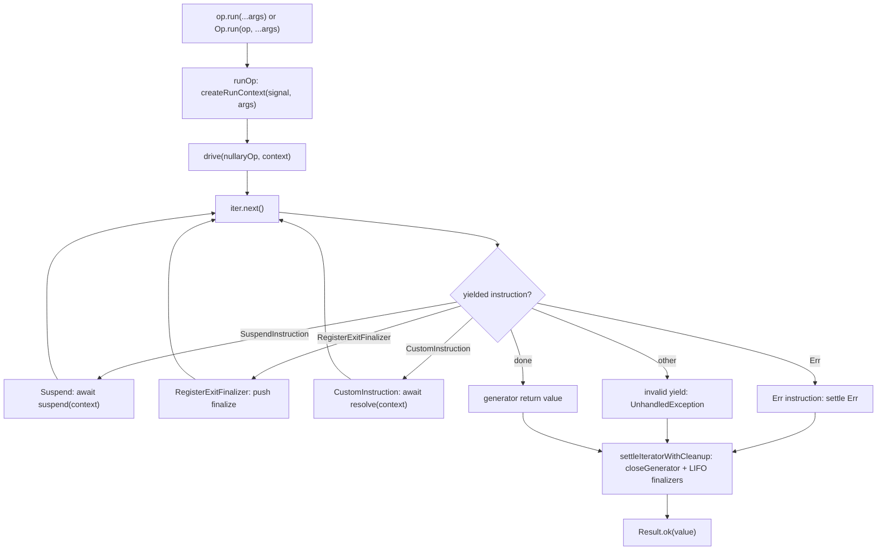

# Core runtime architecture (`@prodkit/op`)

Execution-level map of how a single `Op` run moves through the codebase. Correctness invariants
(cleanup ordering, combinator semantics, settlement rules) live in
[`op-invariants.md`](op-invariants.md). ADRs under [`docs/adr/`](../adr/) explain
why the core/fluent split and policy hooks are shaped the way they are. Domain vocabulary and
documentation roles: [`docs/CONTEXT.md`](../CONTEXT.md).

## Module dependency graph

At a high level, public entrypoints fan into builders and combinators, both of which compose
nullary core ops and always settle through the same driver:

```text
packages/op/src/index.ts          (Op factory, Op.run, re-exports)
  |-- builders.ts                 (Op.of, Op.try, fromGenFn, Op.defer, ...)
  |-- combinators.ts              (Op.all, Op.any, Op.race, Op.allSettled, Op.settle, ...)
  |-- policy/                     (Policy.* constructors, retry-policy, plan rewriters)
  |-- hkt.ts                      (@prodkit/op/hkt entry)
  |-- core/runtime.ts             (createRunContext, drive, runOp, RunContext, ExitContext)
  |-- core/settlement.ts          (AbortSettlement, withAbortDrain, awaitWithAbort, settlementForSuspendedWork)
  |-- core/settlement-scope.ts    (Settlement presets/scopes for nested plan and suspend choreography)
  |-- core/child-run-session.ts   (ChildRunSession factories for parent-to-child AbortSignal cascade)
  |-- core/cleanup.ts             (ADR-0003 cleanup helpers: closeGenerator, runFinalizersSafely, chainCleanupFaults)
  |-- core/meta.ts                (EmptyMeta, Blocking, MergeMeta, IsRunnable)
  |-- core/fluent.ts              (makeCoreOp: nullary generator leaf factory)
  |-- core/plan/                  (Plan AST, fluent shell, lifecycle, transforms)
  |-- core/instructions.ts        (Suspend, RegisterExitFinalizer, CustomInstruction protocol)

packages/op/src/di/                 (DI.provide, DI.inject via CustomInstruction + extensions)
  '-- di/plan.ts imports di/env.ts, di/types.ts, core/plan, core/settlement-scope, core/instructions
  '-- di/env.ts imports di/types.ts, core/runtime, core/settlement-scope, @prodkit/shared/runtime
  '-- di/types.ts imports core/meta.ts, index.ts (type-only Op)

Verified import contracts (checked by `pnpm --filter @prodkit/tools run architecture:check`):

**Closed modules** document every `packages/op/src` import from that file. Use for extension seams and
small plan modules where surprise imports are regressions.

<!-- architecture-check-closed: packages/op/src/di/types.ts -->
<!-- architecture-check-closed: packages/op/src/di/env.ts -->
<!-- architecture-check-closed: packages/op/src/di/plan.ts -->
<!-- architecture-check-closed: packages/op/src/core/plan/factory-chain.ts -->
<!-- architecture-check-closed: packages/op/src/core/settlement-scope.ts -->
<!-- architecture-check-closed: packages/op/src/core/child-run-session.ts -->

**Partial edges** document specific architectural links. Each line must match source; hub modules
(for example `shell.ts`) may import more than the list shows.

- `packages/op/src/core/plan/shell.ts` imports `packages/op/src/core/plan/factory-chain.ts`
- `packages/op/src/di/types.ts` imports `packages/op/src/core/meta.ts`
- `packages/op/src/di/types.ts` imports `packages/op/src/index.ts`
- `packages/op/src/di/types.ts` imports `packages/op/src/di/index.ts`
- `packages/op/src/di/env.ts` imports `packages/op/src/di/types.ts`
- `packages/op/src/di/env.ts` imports `packages/op/src/core/runtime.ts`
- `packages/op/src/di/env.ts` imports `@prodkit/shared/runtime`
- `packages/op/src/di/plan.ts` imports `packages/op/src/di/types.ts`
- `packages/op/src/di/plan.ts` imports `packages/op/src/di/env.ts`
- `packages/op/src/di/plan.ts` imports `packages/op/src/core/plan/base.ts`
- `packages/op/src/di/plan.ts` imports `packages/op/src/core/plan/surface.ts`
- `packages/op/src/di/plan.ts` imports `packages/op/src/core/plan/shell.ts`
- `packages/op/src/di/plan.ts` imports `packages/op/src/core/instructions.ts`
- `packages/op/src/di/plan.ts` imports `packages/op/src/core/runtime.ts`
- `packages/op/src/di/plan.ts` imports `packages/op/src/core/meta.ts`
- `packages/op/src/di/plan.ts` imports `packages/op/src/errors.ts`
- `packages/op/src/di/plan.ts` imports `packages/op/src/result.ts`
- `packages/op/src/di/plan.ts` imports `packages/op/src/index.ts`
- `packages/op/src/di/plan.ts` imports `@prodkit/shared/runtime`
- `packages/op/src/core/plan/factory-chain.ts` imports `packages/op/src/core/plan/base.ts`
- `packages/op/src/core/settlement-scope.ts` imports `packages/op/src/core/instructions.ts`
- `packages/op/src/core/settlement-scope.ts` imports `packages/op/src/core/plan/base.ts`
- `packages/op/src/core/settlement-scope.ts` imports `packages/op/src/core/runtime.ts`
- `packages/op/src/core/settlement-scope.ts` imports `packages/op/src/core/settlement.ts`
- `packages/op/src/core/settlement-scope.ts` imports `packages/op/src/errors.ts`
- `packages/op/src/core/settlement-scope.ts` imports `packages/op/src/result.ts`
- `packages/op/src/core/settlement-scope.ts` imports `@prodkit/shared/runtime`
- `packages/op/src/core/child-run-session.ts` imports `packages/op/src/core/runtime.ts`
- `packages/op/src/core/child-run-session.ts` imports `@prodkit/shared/runtime`
- `packages/op/src/core/plan/combinators.ts` imports `packages/op/src/core/settlement-scope.ts`
- `packages/op/src/core/plan/fan-out.ts` imports `packages/op/src/core/child-run-session.ts`
- `packages/op/src/core/plan/fan-out.ts` imports `packages/op/src/core/settlement-scope.ts`
- `packages/op/src/di/env.ts` imports `packages/op/src/core/settlement-scope.ts`
- `packages/op/src/di/plan.ts` imports `packages/op/src/core/settlement-scope.ts`
- `packages/op/src/policy/plan.ts` imports `packages/op/src/core/child-run-session.ts`
- `packages/op/src/policy/plan.ts` imports `packages/op/src/core/settlement-scope.ts`

packages/std/src/                   (reserved runtime-agnostic utility subpaths)
```

## From `Op.run()` to `drive()`

1. **Call site.** `await op.run(...args)` or `await Op.run(op, ...args)` both end in
   `runOp` (`packages/op/src/core/runtime.ts`), which calls
   `drive(op, createRunContext(signal, args))`. Tuple args flow into `RunContext.args` for
   enter/exit hooks; they are not an options bag
   ([ADR 0006](../adr/0006-run-args-only-fluent-policy-composition.md)).
2. **Arity binding.** For generator-defined ops, `fromGenFn` in `builders.ts` wraps the user
   generator in `makeCoreOp` once per `op(...args)` call, binds defer args via
   `bindArityArgsToFinalizers`, and exposes the callable through `makeUnboundPlanOp`
   ([ADR 0001](../adr/0001-core-nullary-vs-lifted-arity.md)).
3. **Nullary execution.** `drive` only accepts `Op<T, E, [], M>`: a nullary op whose body is a
   generator function `() => Generator<Instruction, T>`. Everything that participates in `yield*`
   composition (policies, combinators, `flatMap`, DI `provide`) runs at this arity internally;
   lifting re-attaches tuple call signatures at the public boundary.
4. **Settlement.** `drive` walks instructions until the generator completes or yields a terminal
   `Result.err`, then runs registered exit finalizers LIFO and may override the body result with
   `Err(UnhandledException)` when teardown fails
   ([ADR 0003](../adr/0003-three-cleanup-channels.md),
   [ADR 0005](../adr/0005-unhandled-exception-runtime-channel.md)).

Built-in policies (retry, timeout, cancel) attach on the op value **before** `.run()`, not as extra
`run` parameters ([ADR 0006](../adr/0006-run-args-only-fluent-policy-composition.md)).

## Abort settlement

Low-level primitives live in `packages/op/src/core/settlement.ts`. Parent-to-child signal cascade
uses `ChildRunSession` in `packages/op/src/core/child-run-session.ts` (`isolated`, `pool`,
`boundCancel`). Combinator fan-out drives children through `driveFanOutPlans` in
`packages/op/src/core/plan/fan-out.ts`. Nested plan and suspend choreography uses `Settlement` presets in
`packages/op/src/core/settlement-scope.ts` so call sites declare one intent instead of pairing
`executePlan` settlement args with `withAbortDrain`.

| Preset | Typical use | Notes |
| --- | --- | --- |
| `cooperative` | `Op.allSettled` fan-out children | `passThrough` launch; no drain marker |
| `rejecting` | DI lazy factory resolve | `awaitWork` rejects promptly on abort |
| `interrupting` | Fan-out children, `Policy.timeout` inner nested plan | Interrupt launch; no drain marker |
| `interruptingAndDraining` | Combinators, `DI.provide`, `Policy.cancel` suspend | Interrupt launch plus drain observation |

`settlementForSuspendedWork` still upgrades `interruptOnAbort` to `interruptAndDrainOnAbort` when the
suspend callback returns drain-marked work. Combinators still wait for loser finalization per
[ADR 0004](../adr/0004-combinators-wait-for-loser-finalization.md) before parent `run()` settles.

## Instruction lifecycle

Each `yield` from an op generator produces an `Instruction` discriminant. `drive` in
`packages/op/src/core/runtime.ts` dispatches on the yielded value:

| Yielded value | Driver action |
| --- | --- |
| `SuspendInstruction` | Await `suspend(runContext)` (abort settlement follows the enclosing `executePlan`; work wrapped with `withAbortDrain(...)` drains if abort interrupts the await), resume generator with the settled value |
| `RegisterExitFinalizerInstruction` | Push `finalize` onto a per-run LIFO stack (optional frozen `args` for arity-bound defers) |
| `CustomInstruction` | Await `resolve(runContext)` and resume (extension hook; see DI below) |
| `Result.err(...)` (`Err` instruction) | Short-circuit to `Err` and run exit finalizers |
| Anything else | `Err(UnhandledException)` for invalid yields |

Suspends are how policies and combinators nest work: they call `executePlan` (with a
`AbortSettlement` when interrupt-on-abort applies) on child plans with child or merged
`RunContext` values rather than blocking the outer generator thread.

## Policy wrappers (retry, timeout, cancel)

Built-in policies attach through `.with(Policy.*)` on the op value (`packages/op/src/core/plan/shell.ts`,
`packages/op/src/policy/index.ts`) and compose as plan wrappers:

- **Retry** (`retryPlan`): loops inner execution inside a `SuspendInstruction`, applies
  `RetryPolicy` delay via abortable sleep (`retries` is the post-failure budget; `delay(retry, cause)`
  uses a 0-based retry index), and stops on success, non-retryable `Err`, or abort.
- **Timeout** (`timeoutPlan`): races inner `executePlan(..., interruptOnAbortSettlement)` against a timer;
  surfaces `TimeoutError` on the typed channel. Invalid `timeoutMs` (negative or non-finite) fails
  at run time as `Err(UnhandledException)`. Error-channel transforms compose through plan rewriters
  ([ADR 0007](../adr/0007-op-execution-plan-ast.md); historical hook detail in superseded
  [ADR 0002](../adr/0002-ophooks-rebuild-and-timeout-asymmetry.md)).
- **Cancel** (`cancelPlan`): merges a caller-supplied `AbortSignal` with the run context signal
  through a composed `AbortController` so either parent or bound signal can cancel the inner run.

Method order on the fluent object defines wrapper nesting (outermost policy is applied last in
the chain). See policy ordering notes in `op-invariants.md`.

## Adding a fluent plan transform

Public fluent methods (`.map`, `.flatMap`, `.on("enter")`, `.with(Policy.*)`, and so on) are
plan AST nodes built in `packages/op/src/core/plan/` and rewritten when a policy attaches. When
you add or rename a transform, keep these touch points in sync:

1. **Plan constructor** in `packages/op/src/core/plan/transforms.ts` for value/error transforms
   (`map`, `flatMap`, `tap`, `mapErr`, `tapErr`, `recover`) or
   `packages/op/src/core/plan/lifecycle.ts` for lifecycle hooks (`.on("enter")`, `.on("exit")`).
   For policy push-through, pass a `rewrite` override that rebuilds after `source.rewrite(rewriter)`
   (use `rewriteUnaryPlan` for single-child wrappers; combinator nodes map each child plan).
2. **Fluent surface** in `packages/op/src/core/plan/shell.ts` (bind-time transform ordering in
   `packages/op/src/core/plan/factory-chain.ts`):
   - add the method on `fluentMethodsForContext`
   - add the method name to `createSyncValueFluentPrototype`'s `methodNames` list when sync-value
     ops should expose the same API
3. **Tests**: extend `packages/op/tests/unit/fluent.test.ts` for fluent behavior; add or extend
   policy rewrite coverage when `.with(Policy.*)` must preserve the transform.

Built-in policies only extend `PlanRewriter.apply` (`policy/plan.ts`). Wrapper nodes own structural
rewrite; no per-transform methods on the rewriter protocol.

**`flatMapPlan` intentionally omits a rewrite override.** Built-in policies wrap the whole node via
`rewriter.apply`; `flatMap` composes a second plan inside the first at run time. Policy retry
therefore re-executes the whole composition including the bind callback (see the
`flatMap + Policy.retry retries the whole composition including bind` test in
`packages/op/tests/unit/fluent.test.ts`). Rewriting only the `source` child would change that
contract.

Extension-owned plan nodes (for example `providePlan` in `@prodkit/op/di`) use the same pattern:
`rewrite` re-wraps `source.rewrite(rewriter)` with node-local options (bindings, concurrency, and so on).

## DI integration via `RunContext.extensions`

`@prodkit/op/di` extends the runtime without forking the driver:

1. **`DI.inject(dependency)`** yields an `InjectInstruction`, a `CustomInstruction` whose
   `resolve(context)` reads bindings from `context.extensions`.
2. **`DI.provide(op, bindings)`** (`providePlan` / `provideOp` in `packages/op/src/di/plan.ts`; env in `packages/op/src/di/env.ts`)
   is a plan-backed op (`makeUnboundPlanOp`) whose `providePlan` node returns
   `withAbortDrain(executePlan(..., interruptOnAbortSettlement))` and extends `context.extensions`
   with the binding `Map` under an internal extension key.
   Policy attach rewrites the inner source via `providePlan(source.rewrite(rewriter), bindings)`.
3. **Metadata.** Provided dependencies block bare `.run()` until satisfied via `ProvidedMeta`
   / `withBlocking` on the op type surface.

Scoped bindings (`DI.scoped`) receive the run `AbortSignal` in their factory (same contract as
`Op.try`). Resolution skips an already-aborted factory call, awaits async factories with
DI-native abort handling, and memoizes only after successful settlement.

Custom instructions are the supported extension point for other packages that need run-scoped
state visible inside `SuspendInstruction` and `CustomInstruction.resolve` callbacks.

## Runnable metadata (`Blocking`, `withBlocking`)

Top-level `.run()` / `Op.run(...)` are typed only when operation metadata has no unsatisfied
`Blocking<T>` entries (`IsRunnable<M>` in `packages/op/src/core/meta.ts`).

- **`Blocking<T>`** is branded metadata; merge at a key unions payloads with other `Blocking`
  values at that key.
- **`withBlocking(op, key)`** is a type-only helper on `@prodkit/op/internal`; runtime behavior of
  the op is unchanged. Clears when your extension replaces or removes the blocking entry on `key`.
- **DI**: `DI.inject` accumulates `{ deps: Blocking<Dependency> }`; `DI.provide` clears satisfied
  keys. Consumer-facing behavior is documented under `@prodkit/op/di` in
  [`packages/op/README.md`](../../packages/op/README.md).

### CI contract (compile-time gating, not line coverage)

`.run()` gating is enforced at type-check time, not inside `runOp`. Vitest coverage excludes the
compile-time gating modules on purpose; line counts there are not a useful regression signal.

`pnpm run gate` runs `runnable-gating:check` (`@prodkit/tools`), which verifies those coverage
excludes stay in place and that stable Vitest describe/test titles for metadata merge,
`Blocking` / `IsRunnable`, DI blocking on `Op.run`, and DI missing-dependency behavior still
exist somewhere under `@prodkit/op` tests. The checker keys off titles, not file paths, so suites
may move when titles are preserved. Do not treat adding those modules to coverage as a substitute
for that check or for the op package Vitest run (including typecheck).

Import extension helpers from `@prodkit/op/internal` (for example `Blocking`, `withBlocking`,
`EmptyMeta`, `MergeMeta`, `InferOpMeta`, `CustomInstruction`, `BlockingOp`, `RunContext`,
`CUSTOM_INSTRUCTION_META`). Workspace-only runtime primitives (`AbortSignalLike`, `unsafeCoerce`,
`NEVER`, and similar) live on `@prodkit/shared/runtime`, not on this subpath. The main
`@prodkit/op` entry keeps consumer-facing lifecycle types (`EnterContext`, `ExitContext`) and
errors only.

## Combinators and nested plan execution

`packages/op/src/core/plan/combinators.ts` and `packages/op/src/core/plan/fan-out.ts` run combinator
child plans through `Plan.execute` / `executePlan` (often with per-child `AbortController` signals)
and enforce ordering contracts documented in `op-invariants.md`. `Op.settle` is a unary
`settlePlan` wrapper with `AbortSettlement.passThrough`. `Op.all`, `Op.any`, and `Op.race` wait for
aborted sibling finalization before the parent `run()` settles
([ADR 0004](../adr/0004-combinators-wait-for-loser-finalization.md)). Interrupt-on-abort fan-out
uses `executePlan(..., interruptOnAbortSettlement)` so aborted losers still unwind when they never observe
the signal. Fan-out and provision suspends wrap their returned work with `withAbortDrain(...)` so outer
`Policy.timeout` can drain in-flight nested work before returning `TimeoutError`.

## Driver loop (call flow)



For a traced example, start from [`examples/op/`](../../examples/op/) (especially defer, signal, and
combinator samples) and follow imports into `core/runtime.ts`.
